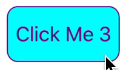
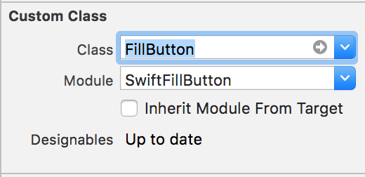
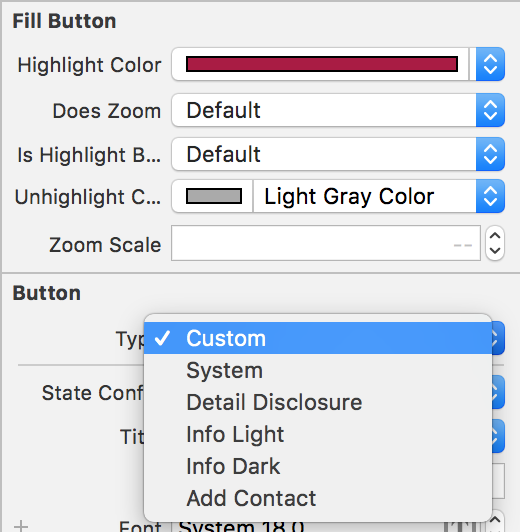

# SwiftFillButton

[](https://travis-ci.org/kha26/SwiftFillButton)
[](https://cocoapods.org/pods/SwiftFillButton)
[](https://cocoapods.org/pods/SwiftFillButton)
[](https://cocoapods.org/pods/SwiftFillButton)

Simple button in Swift that fills up on a click.




## Installation

SwiftFillButton is available through [CocoaPods](https://cocoapods.org). To install
it, simply add the following line to your Podfile:

```ruby
pod 'SwiftFillButton'
```

## Usage

```swift
let button3 = FillButton()

// The highlight color is the color that the backround will be on click
button3.highlightColor = UIColor.purple
button3.unhighlightColor = UIColor.cyan

// To set the text bold on click
button3.isHighlightBold = true

// To add zoom on click
button3.doesZoom = true

// If the zoomScale is greater than 1 the button will increase in size on click
// if it's less than 1 the button will be smaller on click
button3.zoomScale = 1.05
```

## Interface Builder (Storyboard/Xib)

Add a  `UIButton` as usual, then:
- Modify the underlying class to `SwiftFillButton/FillButton` and that the module to `SwiftFillButton`
- Make sure the `UIButtonType` is set to `.custom`





## Example

To run the example project, clone the repo, and run `pod install` from the Example directory first.

## Author

kha26, kha26@cornell.edu

## License

SwiftFillButton is available under the MIT license. See the LICENSE file for more info.
